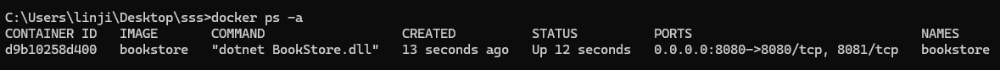
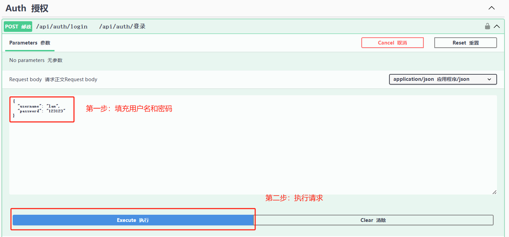
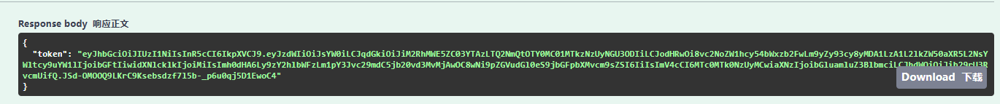
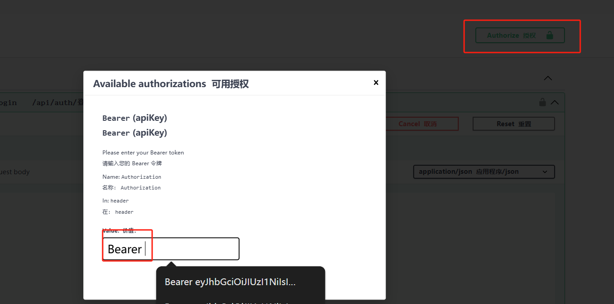
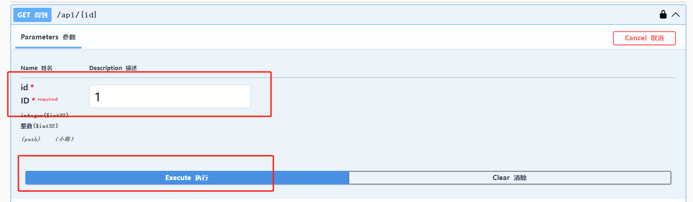
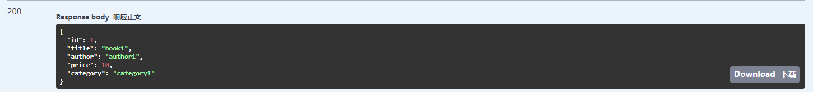
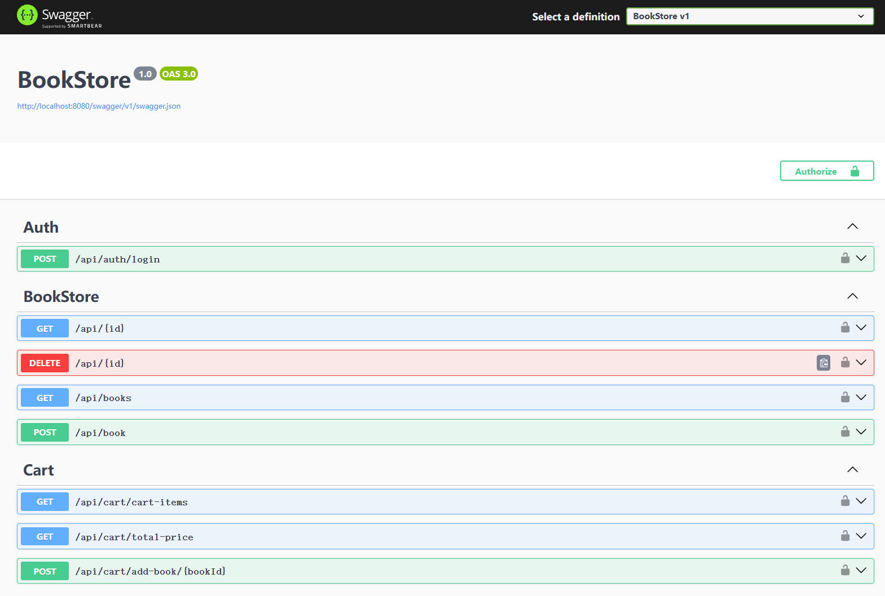
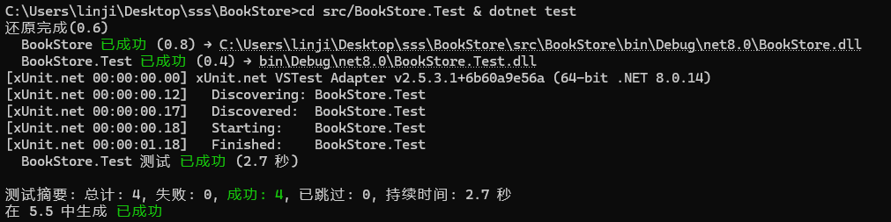

<!-- TOC -->
- [BookStore 在线书籍商店](#bookstore-在线书籍商店)
    - [介绍](#介绍)
    - [功能](#功能)
    - [项目结构](#项目结构)
    - [本地安装](#本地安装)
    - [docker安装](#docker安装)
    - [初始化数据](#初始化数据)
    - [用户名和密码](#用户名和密码)
    - [登录获取token](#登录获取token)
    - [添加token](#添加token)
    - [请求接口](#请求接口)
    - [展示效果](#展示效果)
    - [运行单元测试](#运行单元测试)
<!-- /TOC -->
# BookStore 在线书籍商店
### 介绍
 一个基于.net8平台实现的在线书籍商店的项目，使用内存数据库暂存数据，RESTful API的设计风格。

### 功能
* 1.jwt验证
* 2.购物车
* 3.书籍管理

### 项目结构
```
+---Controllers     --控制器层
+---Entities        --数据实体层
+---Models          --视图模型
+---Repository      --DAL
+---Services        --BAL
```

### 本地安装
* git clone [git@github.com:JIAOZAI1/BookStore.git](https://github.com/JIAOZAI1/BookStore.git)
* 运行 cd BookStore/src/BookStore & dotnet run --urls=https://localhost:5001
* 浏览器访问：https://localhost:5001/swagger
  

### docker安装
* git clone [git@github.com:JIAOZAI1/BookStore.git](https://github.com/JIAOZAI1/BookStore.git)
* 运行 cd BookStore/src/BookStore & docker build -t bookstore:latest . & docker run -p 8080:8080 bookstore
* docker 运行后截图 
* 浏览器访问：http://localhost:8080/swagger

### 初始化数据
``` C#
            dbContext.Books.AddRange(new List<Entities.Book>
            {
                new Entities.Book{ Title="book1",Author="author1",Price=10d,Category="category1"},
                new Entities.Book{ Title="book2",Author="author2",Price=11d,Category="category2"},
                new Entities.Book{ Title="book3",Author="author3",Price=12d,Category="category3"},
            });

            dbContext.User.AddRange(new List<Entities.User>
            {
                new Entities.User{ Id=1,Name="admin",Password="123123",Role="admin"},
                new Entities.User{ Id=2,Name="lam",Password="123123",Role=""},
            });
```

### 用户名和密码
```
admin角色
用户名：admin
密码：  123123

无角色
用户名：lam
密码：  123123
```

### 登录获取token



### 添加token


### 请求接口


### 展示效果


### 运行单元测试
* cd src/BookStore.Test & dotnet test
* 